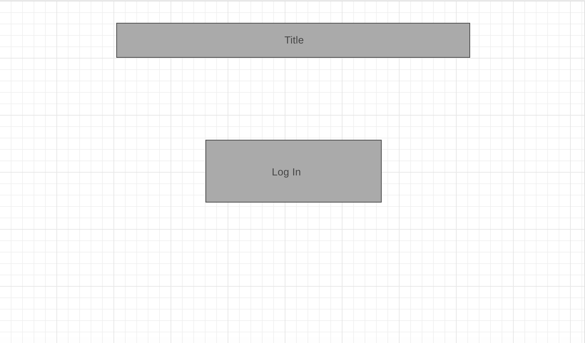
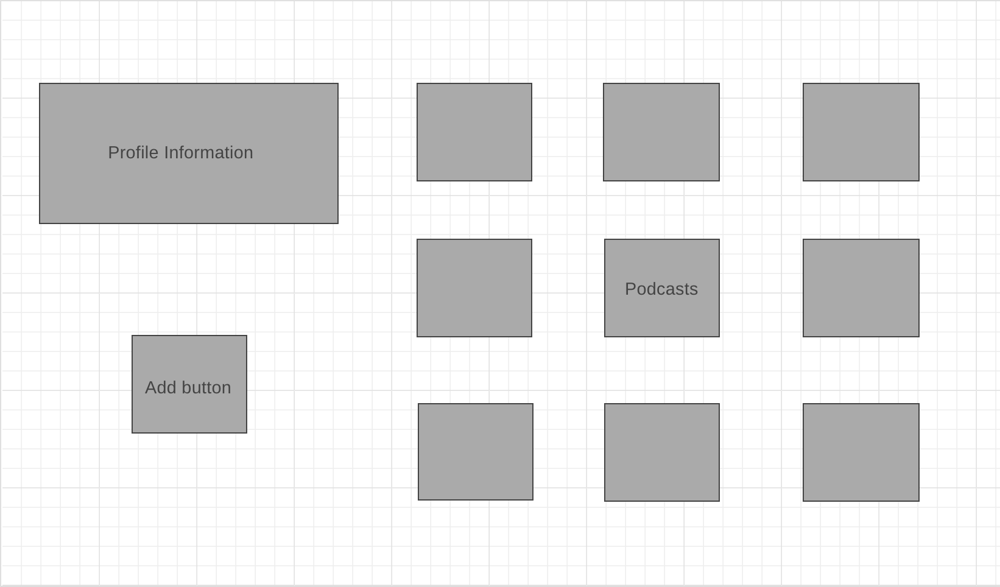
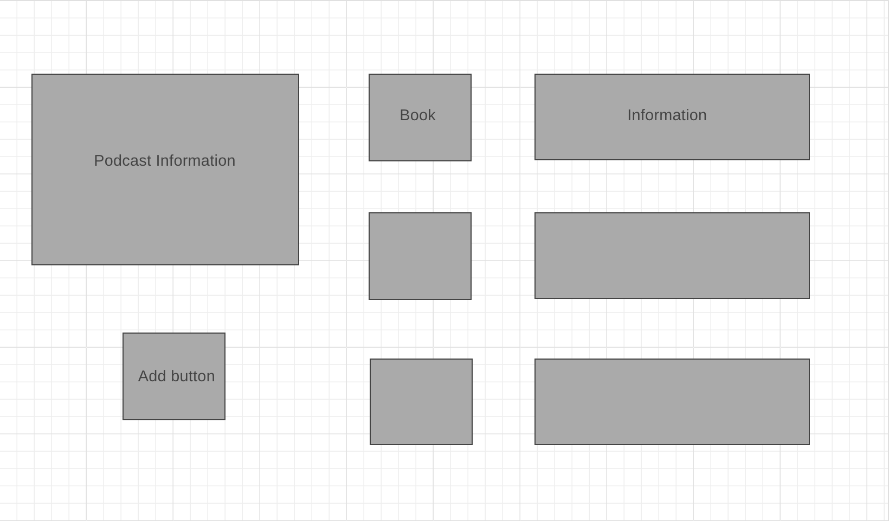
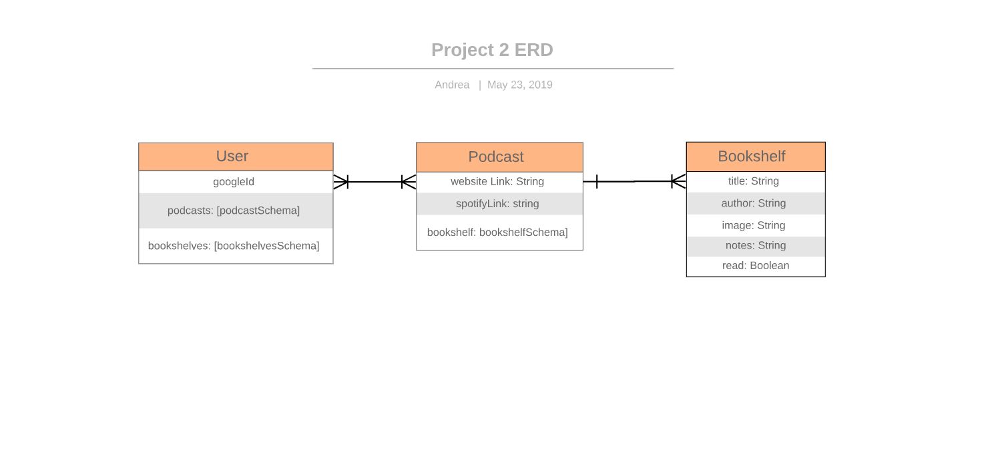

# The Podcast Bookshelf
The Podcast Bookshelf is a web app that allows you to keep track of reading material mentioned during podcast episodes

## Planning

## Technologies Used: 
* CSS
* HTML 
* JavaScript
* MongoDB
* Mongoose 
* Node.js 

## Getting Started
[App Link](placeholder)

### Instructions:
1) Log in using your google ID
2) Add podcasts to your home page
3) Add bookshelves to your podcasts
4) Add books to those bookshelves
5) Enjoy!

## Next Steps and Future Enhancements 
The next iteration of the app will link to Itunes/Spotify API to make podcasts searchable 
It will also use Amazon's API to provide a link next to books you add so you can click and buy  